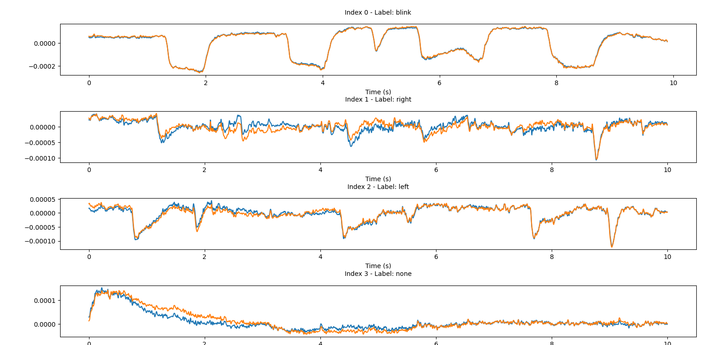
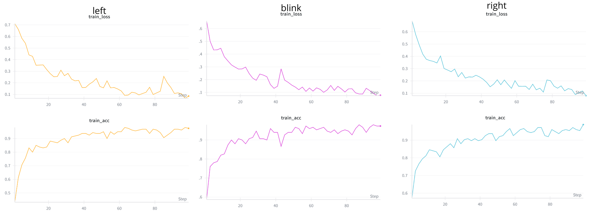

# NeuroSwipe&Shop — Heroes of the Brain

NeuroSwipe&Shop is a hackathon prototype that lets users swipe through products (Tinder-style) using EEG gestures captured with a BrainAccess Halo device. The Python backend reads EEG, preprocesses it, runs an ensemble detector (blink / left / right) and sends keypresses to the frontend UI via Selenium.

What this README covers:
- What the app is
- How to run the frontend (npm)
- How to run `product_swipe.py` (EEG → frontend bridge)

## Quick summary
- Frontend: simple React swipe UI in `src/` and `index.html`.
- EEG pipeline: `EEGDeviceControl` — collection, preprocessing, training and live bridge (`product_swipe.py`).

## Requirements
- Node.js + npm
- Python 3.8+ with dependencies used in `EEGDeviceControl` (PyTorch, pytorch-lightning, numpy, scipy, mne, selenium, brainaccess_board, etc.)
- Chrome and a matching `chromedriver` on PATH
- BrainAccess Halo device available and reachable by the `brainaccess_board` library

## Run the frontend (dev)
From the `swipeApp/` folder:

```bash
cd swipeApp
npm install
npm run dev
```

The frontend is expected at `http://localhost:5173` by default.

## Run EEG → UI bridge (`product_swipe.py`)
`product_swipe.py` opens the frontend in Selenium, reads EEG from the BrainAccess Halo, preprocesses samples, queries the ensemble model and sends key events to the page (mapped to swipe actions).

1. Start the frontend dev server (see above).
2. Ensure `chromedriver` is installed and executable, and Chrome is installed.
3. Run the bridge script from the repository root:

```bash
python3 swipeApp/EEGDeviceControl/product_swipe.py
```

Notes:
- The script expects model checkpoints in `EEGDeviceControl/neuro_hackathon_eeg/`. Edit paths in the script if needed.
- Default key mapping: `blink` → `w`, `left` → `a`, `right` → `d`.
- Ensure your BrainAccess device is paired and the `brainaccess_board` connector works before launching the script.

## Optional: collect data
To gather labeled EEG samples (example command):

```bash
python3 swipeApp/EEGDeviceControl/collect.py --time 2 --num_samples 500 --label blink --num_rounds 10
```

Collected samples are stored as JSON under `EEGDeviceControl` (see scripts for exact filenames).

## Preview images
Filtered sample, training curves and confusion matrix are included in the repository root `images/` folder and previewed here:






## Quick troubleshooting
- Selenium / Chrome errors: check `chromedriver` version and file permissions.
- Device connection: verify `brainaccess_board` diagnostic tools can see the Halo.
- Preprocessing issues: ensure recordings are long enough to pass filter/length guards in `data_preprocessing.py`.
